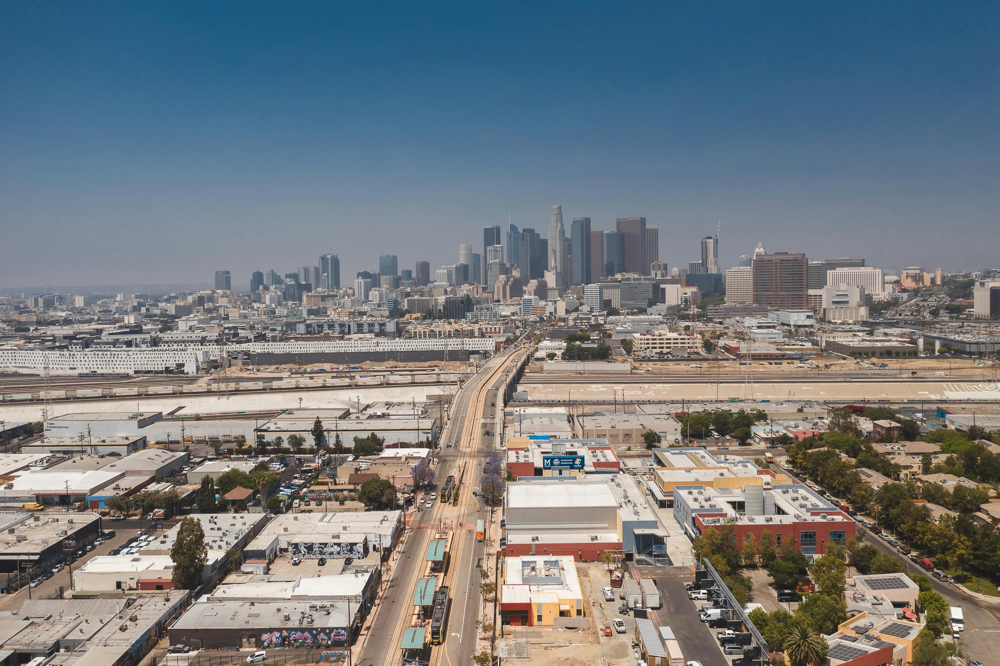
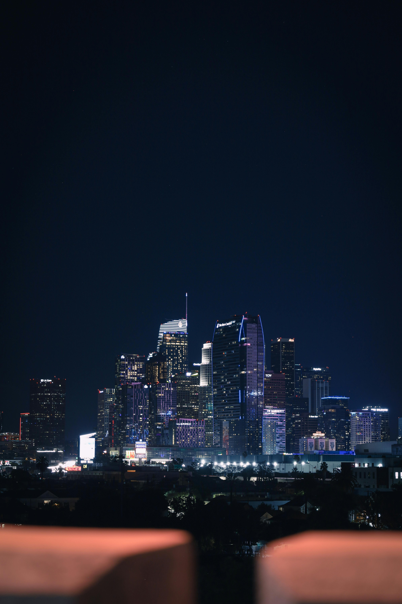
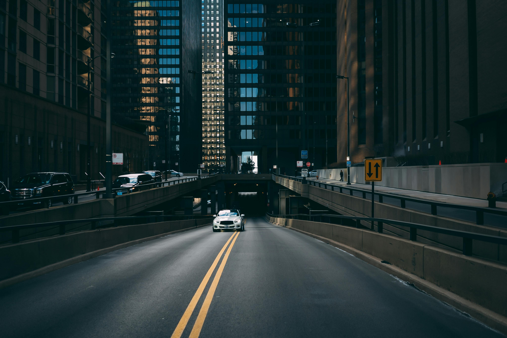
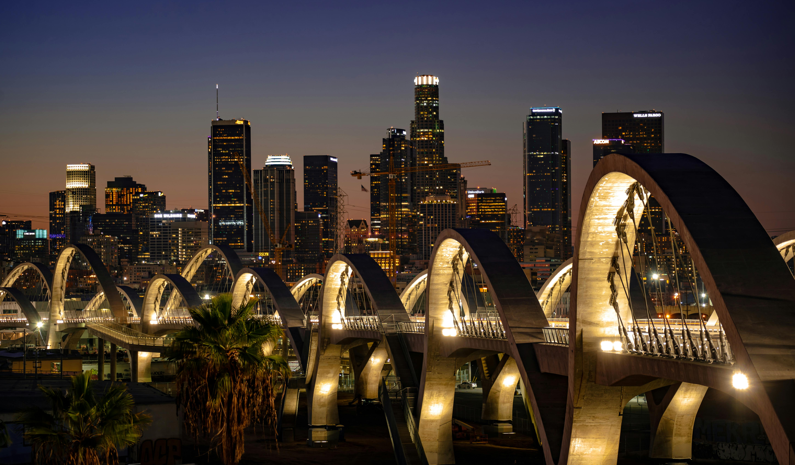
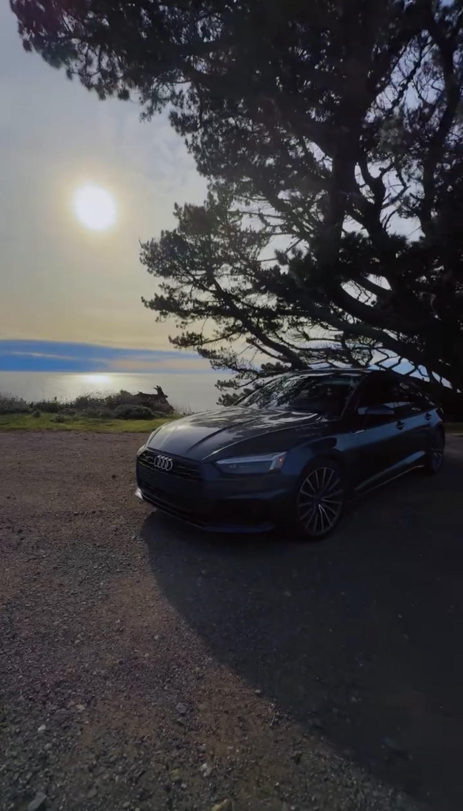

# HIRECAR MarketWatch — Session Handoff
**Date:** March 9, 2026
**Engineer:** Claude (AI pair-programmer)
**Owner:** Ken Eckman
**Previous Commit:** `490c023`
**Live URL:** https://hirecar-marketwatch.pages.dev

---

## Summary

This session refined the **mobile hero carousel Ken Burns animations and transitions**. All 6 slides were converted from side-panning to **pure pull-in zoom** (toward the viewer). The Kobe Bryant mural transition was reworked for smoother blending with the LA aerial behind it. Slide 2 (LA night skyline) was **cropped tight on the downtown skyline** and repositioned per owner direction. All cross-dissolve timings were increased for smoother blends throughout.

---

## What Changed

### 1. Kobe Bryant Slide — Pure Pull-In Zoom (Previously Side-Pan)
- **Keyframe `kbMobZoom1` (line ~3958):** Changed from `scale(2.0) translateX(0%) → scale(2.1) translateX(-4%)` to **`scale(2.0) → scale(2.25)`**
- Kobe now zooms straight toward the viewer instead of panning sideways
- The `object-fit: contain` + `left top` origin + CSS mask gradient (6-stop blend) are unchanged

### 2. Kobe Dissolve — Slower & Smoother Blend
- **Line ~3939:** Transition increased from `5.5s` → **`6.5s`** with softer curve `cubic-bezier(0.2, 0, 0.1, 1)`
- The aerial (slide 0) stays active behind Kobe to fill the transparent bottom zone created by the CSS mask
- Combined with the longer dissolve, this creates a cinema-quality blend between the aerial and Kobe's mural

### 3. Slide 2 (LA Night Skyline) — Cropped Tight on Downtown
- **Object-position (line ~3964):** `50% 95%` → **`50% 88%`** — frames the skyline with a touch more sky above
- **Transform-origin (line ~3965):** Added **`50% 95%`** — zoom anchored near the bottom where the buildings are
- **Keyframe `kbMobZoom2` (line ~3970):** Starting position locked to **`scale(2.0) translateX(-12%) translateY(2%)`**
  - This is the owner-approved crop: Ritz-Carlton left of center, blue arches centered, TCW and Aon towers on right
  - End position: `scale(2.15) translateX(-12%) translateY(2%)` — pure pull-in zoom from the locked position

### 4. All Slides — Pure Pull-In Zoom (No Side Panning)
Every Ken Burns animation was simplified to pure scale zoom:

| Slide | Image | Old Animation | New Animation |
|-------|-------|---------------|---------------|
| 0 | 40.jpg LA aerial | `scale(1.0→1.07)` + translateX/Y drift | `scale(1.0→1.1)` pure zoom |
| 1 | Kobe mural | `scale(2.0→2.1)` + translateX(-4%) | `scale(2.0→2.25)` pure zoom |
| 2 | 31.jpg LA night | `scale(2.0→2.1)` + translateX/Y | `scale(2.0→2.15)` from locked crop |
| 3 | 32.jpg Downtown | `scale(1.0→1.06)` + translateX/Y drift | `scale(1.0→1.1)` pure zoom |
| 4 | 50.jpg Viaduct | `scale(1.0→1.07)` + translateX/Y drift | `scale(1.0→1.1)` pure zoom |
| 5 | Audi coastal | `scale(1.0→1.06)` + translateX/Y drift | `scale(1.0→1.1)` pure zoom |

### 5. Cross-Dissolve Timing — Smoother Blends
- **Base transition (line ~3915):** `4s cubic-bezier(0.4, 0, 0.2, 1)` → **`5s cubic-bezier(0.25, 0, 0.15, 1)`**
- **Kobe transition (line ~3939):** `5.5s` → **`6.5s`** with `cubic-bezier(0.2, 0, 0.1, 1)`
- **JS DISSOLVE_TIME (line ~10537):** `4000ms` → **`5500ms`** — cleanup timer matches new CSS duration

---

## Current CSS State — Mobile Carousel (lines ~3908–3997)

### Base Rule (all mobile slides)
```css
.carousel-slide.mobile-slide {
  display: block !important;
  opacity: 0 !important;
  object-fit: cover !important;
  object-position: 60% 50% !important;
  transform: scale(1.0) translateX(0%) translateY(0%);
  transform-origin: 50% 50% !important;
  transition: opacity 5s cubic-bezier(0.25, 0, 0.15, 1) !important;
  will-change: transform, opacity;
}
```

### Kobe Slide (data-mob="1")
```css
.carousel-slide.mobile-slide[data-mob="1"] {
  object-fit: contain !important;
  object-position: left top !important;
  transform-origin: left top !important;
  transition: opacity 6.5s cubic-bezier(0.2, 0, 0.1, 1) !important;
  -webkit-mask-image: linear-gradient(to bottom,
    black 0%, black 18%,
    rgba(0,0,0,0.72) 30%, rgba(0,0,0,0.45) 42%,
    rgba(0,0,0,0.22) 54%, rgba(0,0,0,0.08) 66%,
    transparent 80%);
  mask-image: /* same as above */;
}
@keyframes kbMobZoom1 {
  0%   { transform: scale(2.0); }
  100% { transform: scale(2.25); }
}
```

### Slide 2 — LA Night Skyline (data-mob="2")
```css
.carousel-slide.mobile-slide[data-mob="2"] {
  object-position: 50% 88% !important;
  transform-origin: 50% 95% !important;
}
@keyframes kbMobZoom2 {
  0%   { transform: scale(2.0) translateX(-12%) translateY(2%); }
  100% { transform: scale(2.15) translateX(-12%) translateY(2%); }
}
```

---

## JS advanceSlide Logic (lines ~10575–10610)

```
Slide 0 → 1 (Aerial → Kobe):
  - Aerial stays active behind Kobe (not removed)
  - Kobe dissolves in with 6.5s opacity transition
  - CSS mask blends Kobe's transparent bottom into the aerial

Slide 1 → 2 (Kobe → LA Night):
  - Both Kobe AND aerial are cleaned up after DISSOLVE_TIME + 200ms
  - LA Night dissolves in normally

All other transitions:
  - Standard cross-dissolve with 5s opacity + 5500ms JS cleanup
```

---

## Mobile Slide HTML Order (lines ~8959–8964)
```html






```

---

## Session History (Chronological)

1. Verified Kobe face visibility after prior session's `!important` CSS fix
2. Eliminated black space below Kobe by keeping aerial (slide 0) active behind it
3. Removed all wipe/expansion animation effects — pure CSS opacity dissolve only
4. Widened Kobe mask gradient from 4 stops to 6 stops (18%→80% blend zone)
5. Cropped slide 2 sky: `object-position` 50% → 85% → 95% → 88% (final)
6. Cropped slide 2 tight on skyline: `scale(2.0)` + `transform-origin: 50% 95%`
7. Repositioned slide 2 per owner: `translateX(-12%) translateY(2%)` — Ritz-Carlton left, blue arches center, TCW right
8. Converted all 6 slides from side-pan to pure pull-in zoom
9. Increased all dissolve timings for smoother blending (base 5s, Kobe 6.5s, JS 5500ms)

---

## Known Issues / Gotchas

| Issue | Details |
|-------|---------|
| **Kobe mask blend seam** | The 6-stop gradient mask creates a smooth blend zone from 18%→80% of the image height. If the aerial content doesn't match Kobe's lower zone, a faint seam may be visible during mid-dissolve. |
| **Slide 2 hard-coded crop** | The `translateX(-12%) translateY(2%)` is baked into the keyframe start/end. If the image file changes, the crop position needs re-tuning. |
| **Duplicate JS blocks** | Still two `DOMContentLoaded` listeners (block 1 ~line 9616, block 2 ~line 12246). Should be consolidated. |
| **Base transform-origin `!important`** | The base rule sets `transform-origin: 50% 50% !important`. Per-slide overrides must also use `!important` to take effect. |

---

## Dev Server
- **Start:** `python3 -m http.server 8080` from project root
- **Preview viewport:** 375×812 (mobile)
- **Note:** Reload after edits; no hot-reload.

---

## What's Next (Owner Direction Needed)
- Review full carousel cycle on device — verify all pull-in zooms feel right
- Potential fine-tuning of individual slide zoom amounts
- Any remaining slide image adjustments
- Desktop carousel review (this session focused on mobile only)
